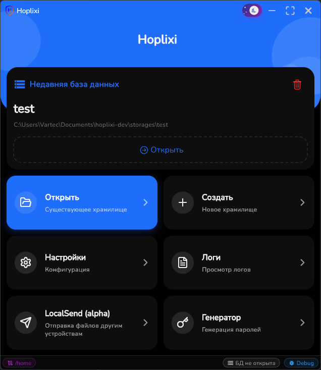
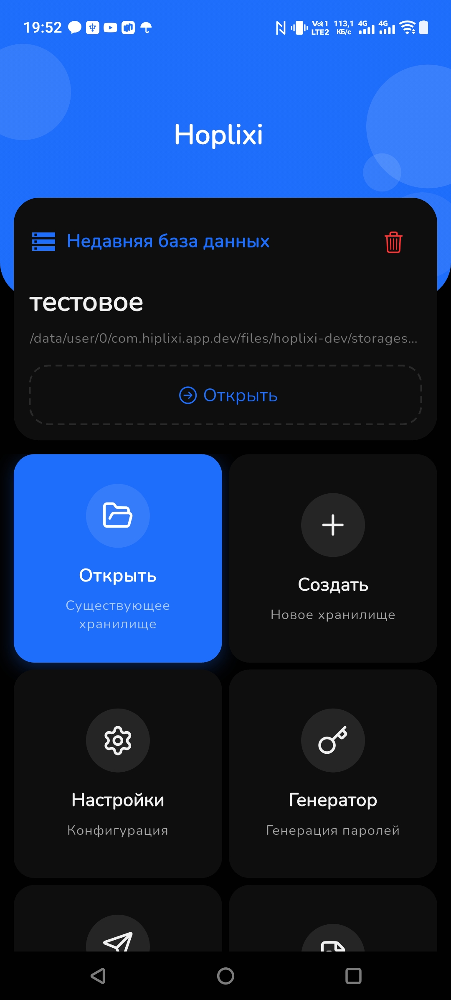
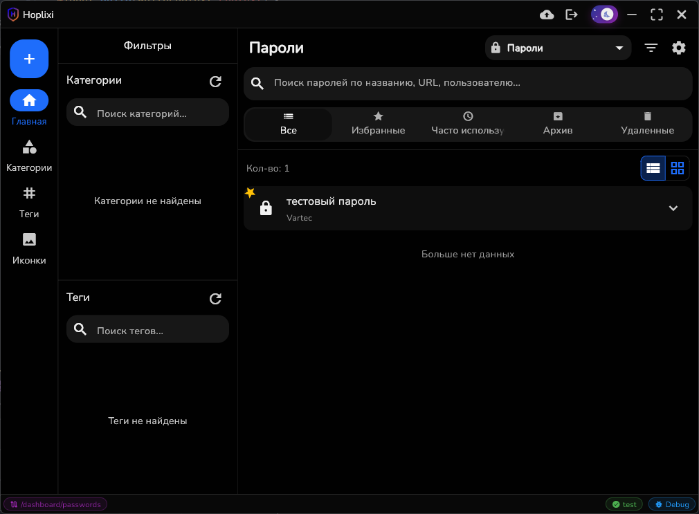
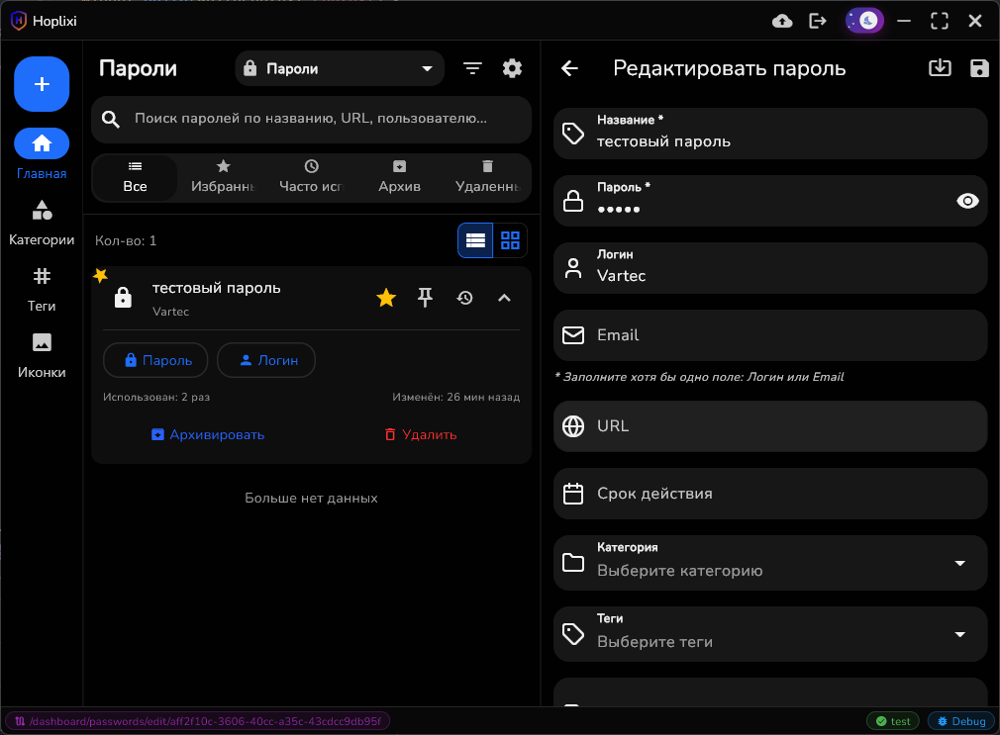
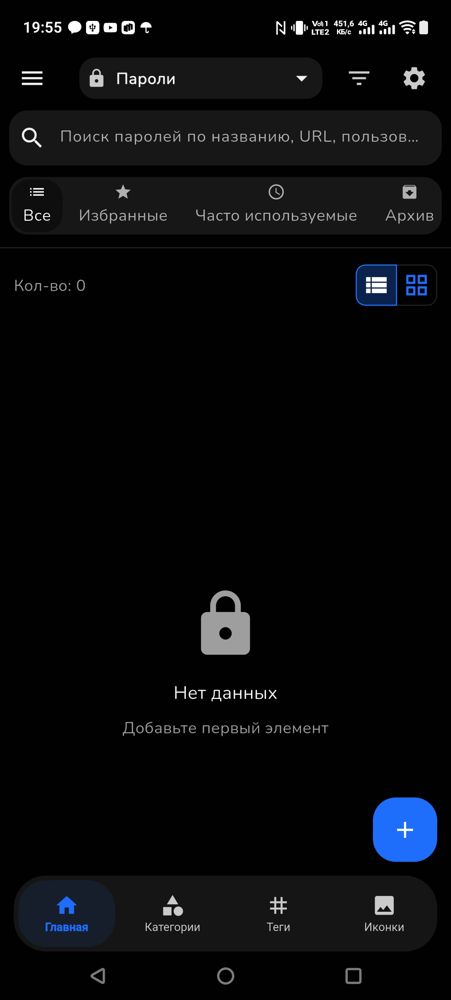
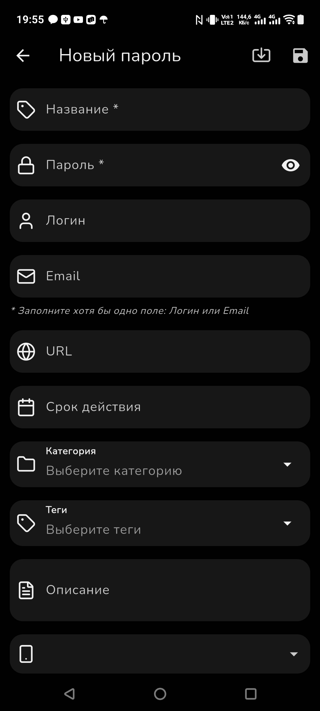

# Hoplixi - Система удобного и защищенного хранения данных 🔐

[](https://flutter.dev/)
[](https://dart.dev/)
[](https://www.rust-lang.org/)
[](LICENSE)

> **Hoplixi** это кроссплатформенное защищённое хранилище: пароли, OTP,
> документы, файлы, ключи, заметки и другие чувствительные данные в одном
> локальном vault с шифрованием, историей изменений, LocalSend и cloud snapshot
> sync.

## 🆕 Что нового в 1.2.0

- Добавлены **Icon Packs**: импорт пользовательских SVG-паков (zip/папка),
  отдельный экран управления и новый picker (пак -> иконка).
- В dashboard появился режим **массовых действий** (multi-select) для
  одновременной обработки нескольких записей.
- Усилена совместимость `store_manifest.json`: добавлены проверки версий
  manifest/schema/app и безопасный сценарий `backup -> migrate -> open`.

Подробности:

- полный changelog: [CHANGELOG.md](CHANGELOG.md)
- release notes v1.2.0:
  [docs/release-notes/v1.2.0-github-release.md](docs/release-notes/v1.2.0-github-release.md)


## ✨ Что уже умеет Hoplixi

### 🔒 Безопасность

- **Локальный vault**: основное хранилище остаётся на вашем устройстве
- **Зашифрованная база**: SQLite3 Multiple Ciphers для защиты store
- **Выбор алгоритма БД**: при создании можно выбрать cipher (сейчас: `chacha20`
  или `sqlcipher`)
- **Шифрование вложений**: файлы и документы шифруются отдельно перед записью на
  диск
- **Мастер-пароль**: обязательная защита для открытия хранилища
- **Биометрия и PIN**: поддержка системной биометрии, PIN-кода и авто-блокировки
- **Безопасные настройки**: часть чувствительных операций может требовать
  дополнительное подтверждение

### 🗂 Поддерживаемые типы данных

Hoplixi хранит не только логины и пароли. В одном хранилище уже доступны:

- 🔑 Пароли
- ⏱ OTP / 2FA
- 📝 Заметки
- 💳 Банковские карты
- 📄 Документы
- 📎 Файлы
- 👤 Контакты
- 🔐 API-ключи
- 🧰 SSH-ключи
- 📜 Сертификаты
- 🪙 Криптокошельки
- 📶 Wi-Fi сети
- 🪪 Личные данные
- 🔑 Лицензионные ключи
- ♻️ Коды восстановления
- 🎁 Карты лояльности

Дополнительно доступны:

- категории
- теги
- пользовательские иконки
- пользовательские поля
- история изменений для записей

### ☁️ Cloud Sync

В приложении уже реализована облачная snapshot sync для текущего хранилища.

Что доступно сейчас:

- OAuth-подключение облачного аккаунта
- сохранение и обновление OAuth-токенов
- привязка конкретного vault к облаку
- upload локального snapshot
- download удалённого snapshot
- сравнение локальной и удалённой версии
- обработка конфликтов и ручной выбор версии
- индикатор прогресса синхронизации
- сценарий повторной авторизации при устаревшем токене
- синхронизация перед закрытием хранилища

Поддерживаемые облачные провайдеры:

- Dropbox
- Google Drive
- OneDrive
- Yandex Disk

### 📡 LocalSend

Hoplixi включает полноценный модуль локального обмена данными между устройствами
в одной сети без облака и внешних серверов.

Что можно передавать:

- файлы
- текст
- архив хранилища
- зашифрованный пакет OAuth-токенов cloud sync

Что уже реализовано:

- автообнаружение устройств в локальной сети
- подтверждение входящего подключения
- прямая передача через WebRTC
- история отправок и получений
- обработка ошибок и уведомление о разрыве соединения

### 🕰 История и восстановление

- история create / modify / delete для записей
- просмотр прошлых состояний
- восстановление данных из истории
- аудит изменений по сущностям

### 🚀 Повседневное использование

- генерация паролей
- встроенный OTP-генератор
- QR-сканирование для OTP
- анализ одинаковых паролей в dashboard с быстрым переходом к редактированию
- поиск по данным
- фильтрация и организация записей
- категории, теги и иконки
- импорт и управление SVG icon packs
- архивирование хранилища
- импорт и миграции (включая KeePass: `.kdbx` / `.kdb`)

### 📱 Платформы

Все ниже перечисленные платформы поддерживаются и активно разрабатываются, но
некоторые из них могут нуждаться в дополнительном тестировании и оптимизации

- Android (полностью протестировано)
- iOS (нуждается в тестировании на реальных устройствах)
- Windows (полностью протестировано)
- Linux (нуждается в тестировании на разных дистрибутивах)
- macOS (нуждается в тестировании на реальных устройствах)

### 🌐 Локализация

Приложение поддерживает:

| Язык       | Код  | Статус                         |
| ---------- | ---- | ------------------------------ |
| 🇷🇺 Русский | `ru` | Основной язык интерфейса       |
| 🇬🇧 English | `en` | В процессе расширения перевода |

Локализация построена на [`slang`](https://pub.dev/packages/slang), язык
сохраняется между сессиями и переключается без перезапуска.

## 📸 Скриншоты

- Главный экран приложения (PC)
  

- Главный экран приложения (мобильный)
  

- Дашборд (ПК)
  

- Дашборд (ПК, режим редактирования)
  

- Дашборд (мобильный)
  

- Дашборд (мобильный, режим редактирования)
  

## 🛠 Установка и запуск

### Предварительные требования

- [Flutter SDK](https://flutter.dev/docs/get-started/install) рекомендуется
  версия 3.11+
- [Rust](https://www.rust-lang.org/tools/install) для разработки и сборки
- [Dart SDK](https://dart.dev/get-dart) для мобильной разработки: Android Studio
  / Xcode

### Клонирование репозитория

```bash
git clone https://github.com/vartec-chs/Hoplixi
cd Hoplixi
```

### Установка зависимостей

```bash
flutter pub get
```

### Генерация кода

```bash
dart run build_runner build --delete-conflicting-outputs
```

`or is on Windows`

```bash
build_runner.bat
```

### Запуск приложения (dev mode)

#### Android

```bash
flutter run -d android
```

#### iOS

```bash
flutter run -d ios
```

#### Windows

```bash
flutter run -d windows
```

#### Linux

```bash
flutter run -d linux
```

#### macOS

```bash
flutter run -d macos
```

## 📖 Использование

Подробный пользовательский сценарий: [docs/usage-guide.md](docs/usage-guide.md)

### Первый запуск

1. Создайте новое хранилище или откройте уже существующее
2. Задайте мастер-пароль
3. При создании выберите алгоритм шифрования БД (`chacha20` или `sqlcipher`)
4. При необходимости включите биометрию, PIN и авто-блокировку
5. Добавьте первые записи, категории, теги и иконки
6. При желании подключите cloud sync для snapshot-синхронизации vault

### Алгоритм шифрования БД

- Выбранный при создании алгоритм сохраняется в метаданных хранилища.
- При открытии хранилища приложение использует сохранённый cipher.
- Если конфиг хранилища был изменён вручную или повреждён, открыть vault может
  не получиться без восстановления корректных метаданных.

### Добавление новой записи

1. Нажмите кнопку "Создать" на главном экране
2. Выберите тип записи
3. Заполните поля, при необходимости добавьте категорию, теги и иконку
4. Для паролей используйте встроенный генератор
5. Сохраните изменения

### Работа с OTP

1. Откройте создание OTP-записи
2. Отсканируйте QR-код или введите секрет вручную
3. Сохраните запись и используйте встроенный генератор кодов

### Импорт из KeePass

Hoplixi поддерживает импорт данных из KeePass (`.kdbx` и `.kdb`) через
встроенный мастер импорта.

Что доступно в импорте:

- выбор файла базы KeePass
- опциональный keyfile и пароль базы
- preview перед импортом (группы, записи, OTP, заметки)
- импорт OTP, заметок и кастомных полей
- импорт истории/вложений (с учётом настроек)
- опция отключения создания новых категорий при импорте

Базовый сценарий:

1. Откройте импорт KeePass из меню действий
2. Выберите файл базы (`.kdbx`/`.kdb`) и при необходимости keyfile
3. Проверьте preview и параметры импорта
4. Запустите импорт в хранилище

### Облачная синхронизация

1. Откройте настройки cloud sync
2. Подключите один из поддерживаемых провайдеров
3. Привяжите текущее хранилище к облаку
4. Используйте sync now или дайте приложению выполнить sync перед закрытием

## 🏗 Архитектура

Hoplixi построен с использованием современных технологий:

- **Flutter**: Кроссплатформенный UI фреймворк
- **Riverpod**: Управление состоянием
- **Drift**: ORM для работы с базой данных
- **SQLite3 Multiple Ciphers**: Шифрование базы данных
- **Freezed**: Генерация иммутабельных моделей
- **Go Router**: Навигация между экранами
- **Rust**: Для оптимизации криптографических операций и т.п (в будущем)

### Структура проекта

```
lib/
├── app.dart                 # Главный виджет приложения
├── main.dart               # Точка входа
├── core/                   # Базовые сервисы и утилиты
│   ├── logger/            # Логирование
│   ├── services/          # Бизнес-логика
│   ├── theme/             # Темизация
│   └── utils/             # Утилиты
├── features/              # Функциональные модули
│   ├── home/              # Главный экран
│   ├── password_manager/  # Управление паролями
│   ├── settings/          # Настройки
│   └── ...
├── main_store/            # База данных и модели
├── routing/               # Навигация
└── shared/                # Общие компоненты
```

## 🔧 Разработка

### Структура одной единицы хранилища

```text
store_name/
│   store_manifest.json
│   attachments_manifest.json
│   store_name.hplxdb
├───attachments_decrypted/
└───attachments/
```

store_manifest.json - содержит метаданные хранилища (`storeUuid`, `storeName`,
`updatedAt`), параметры совместимости версий (`manifestVersion`,
`lastMigrationVersion`, `appVersion`) и конфигурацию ключа (`keyConfig`, включая
salt, флаг useDeviceKey и выбранный cipher). attachments_manifest.json -
манифест вложений для sync-слоя (`revision`, `filesHash`, список файлов вложений
и их метаданных). store_name.hplxdb - зашифрованная база данных SQLite3 Multiple
Ciphers. attachments_decrypted/ - временная папка для расшифрованных файлов
(может не существовать). attachments/ - папка для зашифрованных файлов.

Примечание по миграции:

- Если хранилище создано в более старой версии, приложение может запросить
  сценарий `backup -> migrate -> open` перед открытием.
- Если хранилище подготовлено в более новой версии приложения/схемы, открытие
  будет заблокировано до обновления клиента.

### Окружения (Flavors)

Проект использует пакет `flutter_flavorizr` для управления окружениями.
Настройки описаны в файле `flavorizr.yaml`. Доступно два окружения:

- **dev**: Для разработки (имя приложения "Hoplixi Dev", bundleId
  `com.hiplixi.app.dev`)
- **prod**: Для релиза (имя приложения "Hoplixi", bundleId `com.hiplixi.app`)

Для генерации настроек окружений используется команда:

```bash
flutter pub run flutter_flavorizr
```

### Сборка для релиза

Для удобной сборки релизных версий в проекте предусмотрен скрипт
`build_prod.bat`. Он позволяет выбрать платформу и автоматически выполняет
необходимые команды, включая инкремент номера сборки (через `cider`) для
Android.

Запуск скрипта сборки:

```bash
build_prod.bat
```

#### Генерация Keystore для Android

Для подписи Android APK необходим keystore. Проект включает скрипты для
генерации debug и production keystore.

**Генерация debug keystore:**

```bash
android\create_debug_keystore.bat
```

Этот скрипт создаст `android/app/debug.keystore` с предустановленными
параметрами для отладки.

**Генерация production keystore:**

```bash
android\create_keystore.bat
```

Этот скрипт создаст `upload-keystore.jks` в папке `android`. Вам будет
предложено ввести информацию для сертификата (имя, организация и т.д.).
**Обязательно сделайте резервную копию этого файла и храните его в безопасном
месте!**

#### Certificate fingerprints и package name для Android

Для настройки Android-приложения и OAuth-провайдеров нужны certificate
fingerprints и package name. Используйте следующие значения:

- Debug package name: `com.hiplixi.app.dev`
- Release package name: `com.hiplixi.app`

Чтобы получить fingerprints для debug-сборки, выполните команду:

```bash
keytool -list -v -alias androiddebugkey -keystore $env:USERPROFILE\.android\debug.keystore -storepass android -keypass android
```

Чтобы получить fingerprints для release-сборки, выполните команду в папке
`android` с вашим release keystore:

```bash
keytool -list -v -keystore my-release-key.jks -alias my-key-alias
```

Команда покажет поля:

- `SHA1`
- `SHA256`

После генерации keystore, убедитесь, что файл `android/key.properties` содержит
правильные пути и пароли:

```
storePassword=ваш_пароль
keyPassword=ваш_пароль
keyAlias=upload
storeFile=../upload-keystore.jks
```

### Генерация кода

```bash
dart run build_runner build --delete-conflicting-outputs
```

#### Ручная сборка Android APK (Prod)

```bash
flutter build apk --flavor prod --release
```

#### Ручная сборка iOS

```bash
flutter build ios --flavor prod --release
```

#### Ручная сборка Windows

Для сборки Windows версии используется утилита `fastforge`:

```bash
fastforge package --platform windows --targets exe
```

Или стандартными средствами Flutter:

```bash
flutter build windows --release
```

### Тестирование

```bash
flutter test
```

### Анализ кода

```bash
flutter analyze
```

### Форматирование

```bash
dart format .
```

## 🤝 Вклад в проект

Мы приветствуем вклад в развитие Hoplixi! Вот как вы можете помочь:

1. **Fork** репозиторий
2. Создайте **feature branch** (`git checkout -b feature/AmazingFeature`)
3. **Commit** изменения (`git commit -m 'Add some AmazingFeature'`)
4. **Push** в ветку (`git push origin feature/AmazingFeature`)
5. Откройте **Pull Request**

### Руководство по контрибьютингу

- Следуйте [Effective Dart](https://dart.dev/effective-dart) гайдлайнам
- Используйте [Flutter lints](https://pub.dev/packages/flutter_lints)
- Пишите тесты для нового функционала
- Обновляйте документацию при внесении изменений

## 💭 Дальнейшее развитие

В README перечислено только то, что уже есть или частично доступно пользователю
сейчас. В следующих версиях проект может получить:

- auto-type и интеграции с браузерами
- дальнейшее развитие UX и кастомизации интерфейса
- расширение cloud и device-to-device сценариев
- дополнительные инструменты импорта, экспорта и автоматизации

## 📄 Лицензия

Этот проект распространяется под лицензией MIT. Подробности в файле
[LICENSE](LICENSE).

## 🙏 Благодарности

- [Flutter](https://flutter.dev/) - за отличный фреймворк
- [Lucide Icons](https://lucide.dev/) - за красивые иконки
- [Riverpod](https://riverpod.dev/) - за управление состоянием
- [Drift](https://drift.simonbinder.eu/) - за удобную работу с базой данных
- [SQLite3 Multiple Ciphers](https://utelle.github.io/SQLite3MultipleCiphers) -
  за надежное шифрование данных
- [Rust](https://www.rust-lang.org/) - за мощный язык программирования для
  сложных задач
- Сообществу Flutter за поддержку и вдохновение

## 📞 Контакты

- **Автор**: [Кирилл](https://github.com/vartec-chs)
- **Email**: misticmvm@gmail.com
- **Telegram**: [@VartecCHS](https://t.me/VartecCHS)
- **Issues**: [GitHub Issues](https://github.com/vartec-chs/hoplixi/issues)

---

<p align="center">
  <b>Hoplixi</b> - Ваш надежный страж цифровой безопасности! 🛡️
</p>

<p align="center">
  
  
  
</p>
