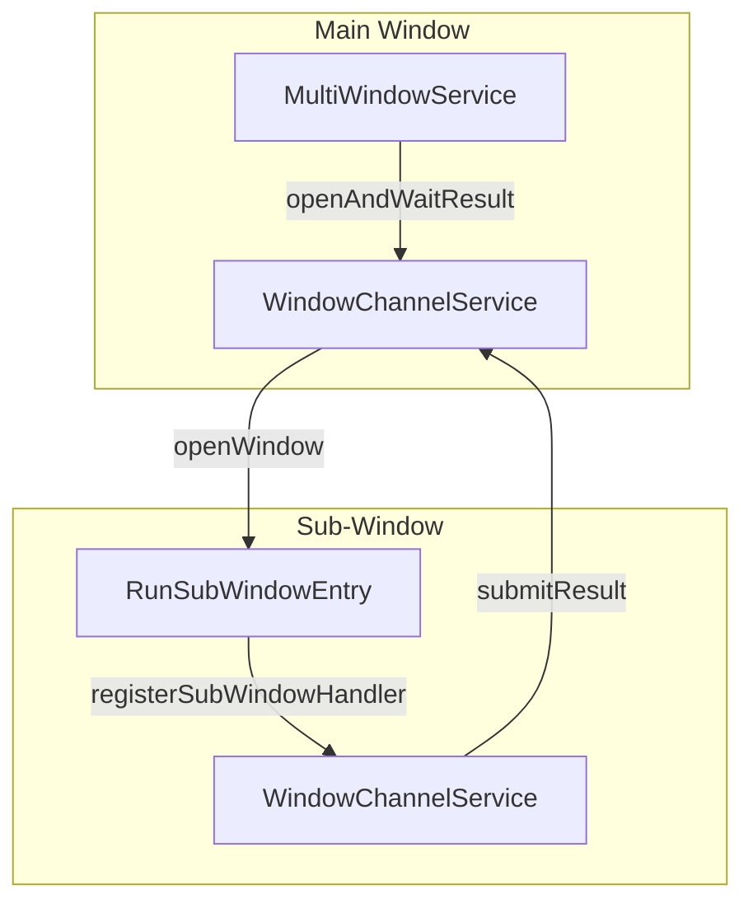

# Multi-Window Architecture and Logging

This document describes the architecture for multi-window support and the
corresponding logging strategy in Hoplixi.

## Multi-Window Support

The application supports running multiple windows (e.g., password generator,
authorization) alongside the main window using the `desktop_multi_window`
package.

### Architecture



### Key Components

1. **`WindowChannelService`
   (`lib/core/multi_window/window_channel_service.dart`)**:
   - A high-level service for inter-window communication.
   - Manages named channels (e.g., `WindowChannels.passwordGenerator`,
     `WindowChannels.auth`).
   - Implements a request-response pattern using `Completer` to await results
     from sub-windows.
   - `registerMainHandler()`: Registers a handler in the main window to receive
     results or cancellation events.
   - `registerSubWindowHandler()`: Registers a handler in the sub-window to
     process requests from the main window.
   - `waitForResult<T>()`: Returns a `Future<T?>` that completes when the
     sub-window sends a result.
   - `submitResult()`: Sends data from a sub-window back to the main window.

2. **`MultiWindowService` (`lib/core/multi_window/multi_window_service.dart`)**:
   - `openWindow()`: Opens a new sub-window or focuses an existing one
     (single-instance mode).
   - `openAndWaitResult<T>()`: Combines opening a window and waiting for a
     result via `WindowChannelService`.

3. **`RunSubWindowEntry` (`lib/run_sub_window_entry.dart`)**:
   - The entry point for sub-windows.
   - Initializes the sub-window environment, including logging (see below) and
     error handling.
   - Sets up the `WindowMethodChannel` handler.

4. **`SubWindowType` (`lib/core/multi_window/sub_window_type.dart`)**:
   - Enum defining available sub-window types, their titles, and dimensions.

### Communication Flow

1. **Main Window**: Calls
   `MultiWindowService.instance.openAndWaitResult<T>(type, channel)`.
2. **Service**: Registers a handler on the specified channel and opens the
   window.
3. **Sub-Window**: Starts up, registers its side of the channel, and displays
   content.
4. **User Action**: User interacts with the sub-window (e.g., generates a
   password and clicks "Use").
5. **Sub-Window**: Calls
   `WindowChannelService.instance.submitResult(channel, result)`.
6. **Main Window**: The `Future` completes with the result.
7. **Sub-Window**: Closes itself (or stays open depending on logic).

---

## Multi-Process Logging

The application uses a unified logging system that supports writing to a single
JSONL file from multiple processes (main window + sub-windows).

### Strategy

- **Atomic Writes**: The `FileManager` uses `FileMode.append` with
  `flush: true`. On Windows, appending short lines (JSONL records) is generally
  atomic at the OS level, preventing file corruption when multiple processes
  write simultaneously.
- **Process Identification**: Each log entry includes a `processId` field (PID)
  to identify the source process.
- **Simplified Metadata for Sub-Windows**: Sub-windows do not collect full
  device telemetry to save resources and avoid redundancy.

### Components

1. **`AppLogger`**:
   - `initialize()` accepts `isSubWindow` and `windowType` parameters.
   - If `isSubWindow` is true, it initializes with a simplified configuration.
   - `CrashReportManager` is **disabled** in sub-windows (crashes are caught and
     logged as errors, but full reports are managed by the main process or
     separate mechanisms).

2. **`DeviceInfo`**:
   - Has a factory `DeviceInfo.subWindow()` that creates a minimal `DeviceInfo`
     object containing only the PID, window type, and platform.

3. **`Session`**:
   - Includes fields `isSubWindow` and `windowType` to distinguish sessions
     created by sub-windows.

4. **`LogEntry`**:
   - Includes a `processId` field.

### Log File Format

The log file (`app_log_YYYY-MM-DD.jsonl`) contains mixed entries from all active
processes:

```json
{"type": "session_start", "processId": 1234, "timestamp": "...", "session": {"isSubWindow": false, ...}}
{"type": "session_start", "processId": 5678, "timestamp": "...", "session": {"isSubWindow": true, "windowType": "passwordGenerator", ...}}
{"sessionId": "...", "processId": 1234, "level": "INFO", "message": "Main window action", ...}
{"sessionId": "...", "processId": 5678, "level": "INFO", "message": "Sub-window action", ...}
```
